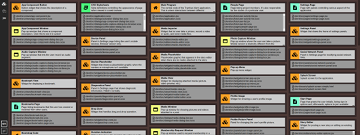
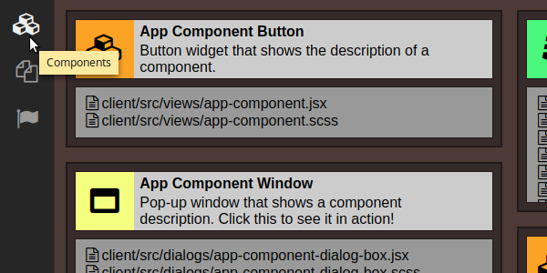
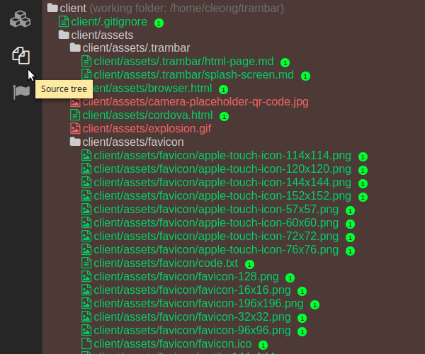
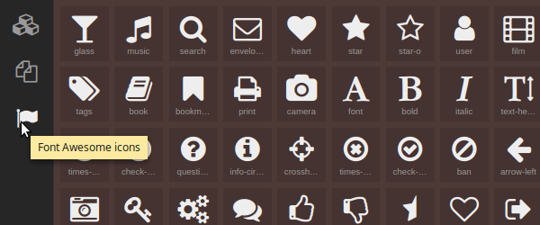
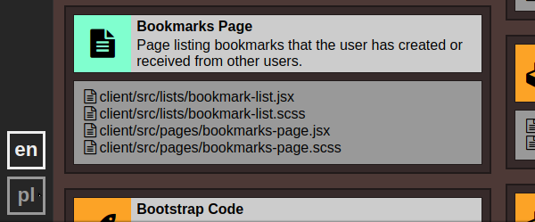

# Trambar-Deco

Trambar-Deco is a utility for previewing [Trambar code decoration](https://github.com/trambarhq/trambar/blob/master/docs/decoration.md).



## Installation

```sh
sudo npm install -g trambar-deco
```

## Usage

In a shell window, cd to the source folder you which to examine and run
`trambar-deco`. A browser window will open, showing you the applicable
decoration. Any changes you make will appear immediately.

Trambar-Deco will automatically exit when you close the browser (or if you
navigate to a different page).

### Viewing components

The **Components** page shows all component descriptions applicable to the files
in the current working directory:



### Viewing source tree

The **Source tree** page shows the source tree, indicating which files are
covered by a description (green) and which are not (red):



Clicking on the bubble at the end of the file path displays the description.
Multiple descriptions could be applicable to a given file.

### Picking Font Awesome icons

The **Font Awesome icons** page lets you pick out a [component icon](https://github.com/trambarhq/trambar/blob/master/docs/decoration.md#component-icon):



Click on the icon to open up the icon dialog box. Change the foreground and
background color if so desired, then click the **Copy** button. The icon's URL
will now be in the clipboard.

### Selecting language

Use the language buttons at the lower-left-hand corner to switch between
[languages](https://github.com/trambarhq/trambar/blob/master/docs/decoration.md#multilingual-descriptions):



## License

This project is licensed under the MIT License - see the [LICENSE.md](LICENSE.md) file for details
